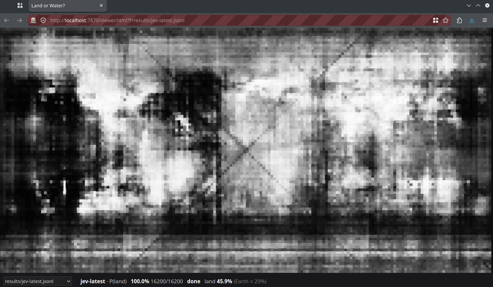
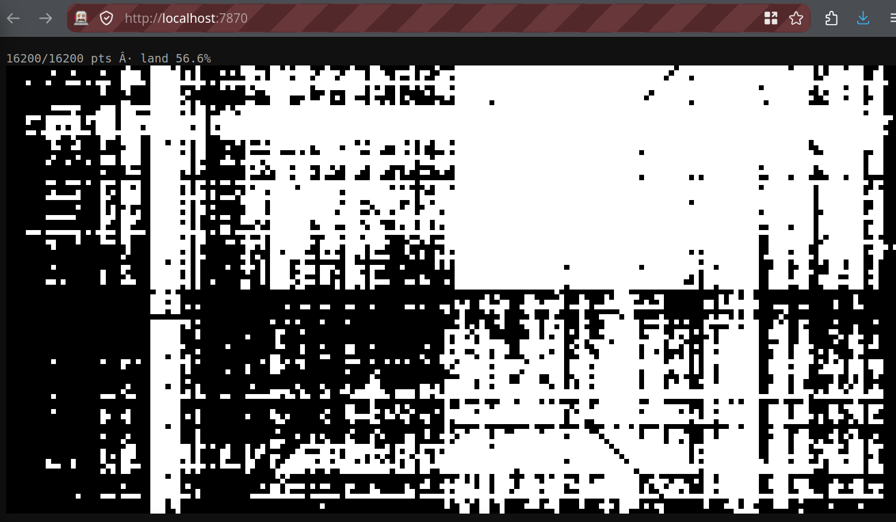

# Land or Water?

**What does a language model think the Earth looks like?** Ask it "land or water?" at 16,200 points of the globe, with no images, no tools and no memory between questions, then plot the answers.

| jev-latest | Qwen3.5-0.8B |
|---|---|
|  |  |

- **Chat models** (any OpenAI-compatible server) answer `Land` or `Water` → a black and white map.
- **[jev](https://typesafe.ai)** scores both options → a map of *how sure* it is (gray = unsure).

## Run it

```bash
pip install requests
python3 land_or_water.py chat              # CHAT_URL=http://host:port, default localhost:6982
python3 land_or_water.py jev               # needs TYPESAFE_API_KEY
python3 -m http.server 7870                # open http://localhost:7870/viewer.html
```

The map fills in live, in random order. Runs resume where they stopped. Settings are at the top of `land_or_water.py`.

`results/` has two finished runs: Qwen3.5-0.8B (chat) and jev-latest.
